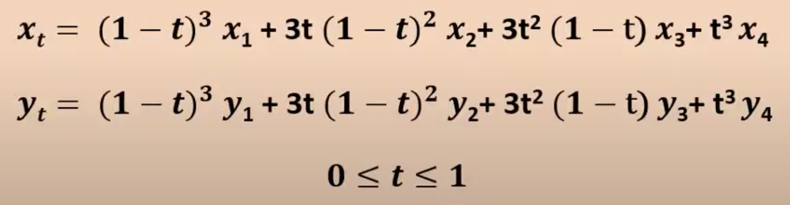
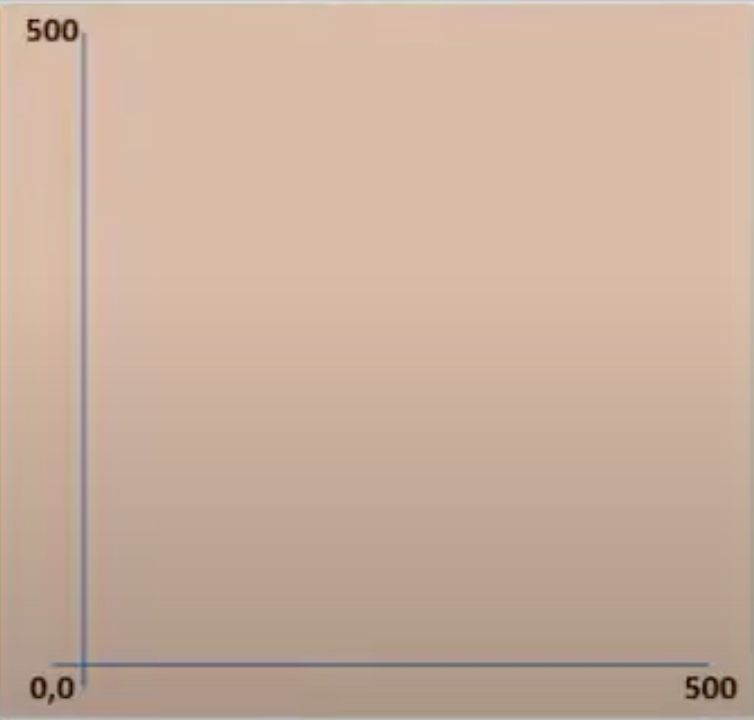
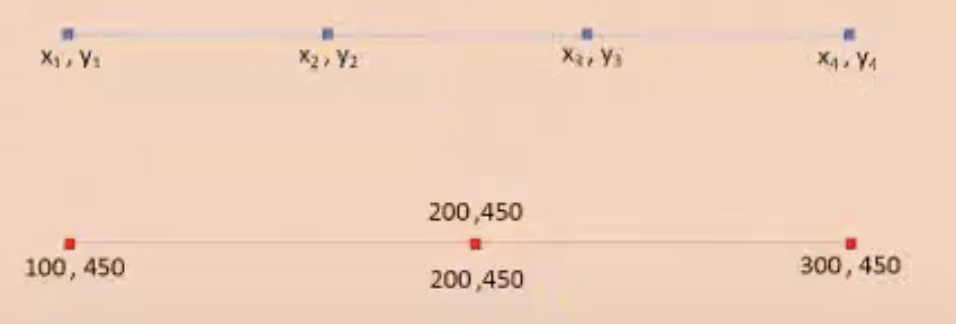

# Overview

- Project Name: Animated Indian Flag
- By [Aritra Bose](https://bose-aritra2003.github.io/my-portfolio-website/)
- Roll No: 2021ITB035
- Course: Computer Graphics
- Semester: 4th
- Department: Information Technology
- Description: This program is an implementation of an animated Indian flag using OpenGL. The flag is drawn using the Bézier curve algorithm to determine the intermediate points of the flag. The flag is animated by moving up and down the two control points of the Bézier curve.

# Demo


On MacOS Ventura I compiled it with the following code:

```bash
gcc -Wno-deprecated-declarations main.c -framework GLUT -framework OpenGL 
```

# Theoretical Background

## Bezier Curves
Bezier curves are a way to draw smooth curves in a computer graphics program. They are used in many applications, including animation, computer-aided design, and computer graphics. They are named after Pierre Bézier, who used them in the 1960s and 1970s for designing the bodywork for Renault cars.


## How do they work?

A Bezier curve is defined by a set of control points. However, for this project we will use 4 control points and this type of curve is called a [cubic Bézier curve](https://cubic-bezier.com/). 
The 4 control points are:
- Start Point: P0 = (x1, y1)
- Control Point 1: P1 = (x2, y2)
- Control Point 2: P2 = (x3, y3)
- End Point: P3 = (x4, y4)


The curve passes through the start and end points, and the control points determine the shape of the curve. The curve is defined by a parametric equation, which is a function of a single variable t. The value of t ranges from 0 to 1. The equation is:




# Our coordinate system

We will be using a coordinate system where the origin is in the bottom left corner of the screen, and the x-axis goes to the right till 500, and the y-axis goes up till 500.



## Initial values of the 4 points

The initial values of the 4 points are:
- P0: (100, 450)
- P1: (200, 450)
- P2: (200, 450)
- P3: (300, 450)



# How to draw the animated components ?

## The stripes

The flag is divided into three horizontal stripes: orange, white, and green.

The program starts by initializing the control points for the Bézier curve. The x array stores the x-coordinates of the control points, and `y1`, `y2`, `y3`, and `y4` store the y-coordinates for the upper boundary of the orange, white, and green stripes, as well as the lower boundary of the green stripe.

The next step is to use the Bézier curve algorithm to determine the intermediate points between the control points. This is done using a loop that iterates from 0 to 1 in increments of 0.01. For each value of `t`, the algorithm calculates the corresponding `x` and `y` values using the formula for cubic Bézier curves:

The resulting `xt`, `y1t`, `y2t`, `y3t`, and `y4t` arrays store the intermediate points along the curves.

Once the intermediate points are calculated, the program draws the flag using the `glBegin` and `glEnd` functions. The `glColor3f` function sets the color for each stripe, and the glVertex2d function is used to specify the vertices of the `GL_QUAD_STRIP` primitives that define each stripe.

Finally, the program calculates the center and radius of the Ashoka Chakra based on the intermediate points for the white stripe, and calls the DrawAshokaChakra function to draw the chakra. The program also draws the flagpole using a `glRecti` function call.

## The Ashoka Chakra

The DrawAshokaChakra function draws the Ashoka Chakra. The function takes in four parameters: the `x` and `y` coordinates of the center of the circle, the radius of the circle, and the number of spokes in the wheel.

The function first sets the color of the circle to blue using the `glColor3f` function. It then defines several variables for use in the for loop that follows.

The circle is drawn using the `GL_LINE_LOOP` mode, which draws a connected set of line segments that form a closed loop. The for loop iterates from 0 to 359, with an increment of 1 degree in each iteration. The angle variable is calculated as the current iteration multiplied by a conversion factor of `PI / 180`. The `cos` and `sin` functions are then used to calculate the `x` and `y` coordinates of the point on the circle at that angle. These coordinates are offset by the center of the circle and the radius of the circle, and the resulting point is added to the list of vertices to be drawn using the `glVertex2d` function.

After all of the vertices of the circle have been defined, the `GL_LINE_LOOP` mode is ended using `glEnd()`.

The spokes of the wheel are then drawn using the `GL_LINES` mode, which draws a set of unconnected line segments. The for loop iterates over the number of spokes specified in the function call. The angle variable is calculated as the current iteration multiplied by an angle increment of `2 * PI / numSpokes`. The `cos` and `sin` functions are then used to calculate the `x` and `y` coordinates of the end point of the spoke. These coordinates are offset by the center of the circle and added to the list of vertices to be drawn using `glVertex2d`, along with the coordinates of the center of the circle. This draws a line segment from the center of the circle to the end point of the spoke.

Finally, the `GL_LINES` mode is ended using `glEnd()`, completing the drawing of the Ashoka Chakra.

## The Clouds

The `DrawEllipse` function takes in four parameters: `x` and `y` which represent the center of the ellipse, and `xRadius` and `yRadius` which represent the horizontal and vertical radii of the ellipse respectively. It then uses the `glBegin` and `glEnd` functions to specify that a polygon will be drawn, and loops through 360 degrees (or 2π radians) to calculate the vertices of the ellipse using trigonometric functions cos and sin. The calculated vertices are then passed to `glVertex2f` to draw the polygon.

The `DrawClouds` function takes in the number of clouds to be drawn as a parameter `(numberOfClouds)`. It sets the color to white using `glColor3f`, and uses the `srand` function with `time(NULL)` as the seed to generate random values for the position (`xPos` and `yPos`) and size (`xRadius` and `yRadius`) of the clouds. It then calls the `DrawEllipse` function multiple times with varying `xPos` values to draw ellipses that represent clouds. The `j` loop inside `DrawClouds` is used to draw multiple ellipses for each cloud with different `xPos` values to create a more natural cloud-like shape.


# Implementation Details

<div class="markdown prose w-full break-words dark:prose-invert light"><h2>Animate Function</h2><p>The program defines the <code>Animate()</code> function to handle the animation of the flag. Inside this function, the <code>if</code> statements are used to check the direction of movement of the two control points. If the <code>animateFlag</code> variable is set to 1, then the <code>if</code> conditions are executed to move the two control points up and down. The <code>glutPostRedisplay()</code> function is called to redraw the screen.</p><h2>Draw Function</h2><p>The <code>Draw()</code> function is used to draw the flag, and all other components in the scenery. Inside this function, the control points of the Bézier curve are initialized. The <code>x</code> and <code>y</code> arrays contain the x and y coordinates of the control points. The <code>yMove</code> and <code>xMove</code> variables are used to move the control points up and down during animation.</p><p>The Bézier curve algorithm is used to determine the intermediate points of the flag. The <code>xt</code>, <code>y1t</code>, <code>y2t</code>, <code>y3t</code>, and <code>y4t</code> arrays contain the intermediate points of the flag. The <code>for</code> loop is used to iterate over the values of <code>t</code> from 0 to 1 with a step of 0.01 to calculate the intermediate points. The intermediate points are calculated using the Bézier curve formula. Finally, the flag is drawn using the <code>GL_QUAD_STRIP</code> mode and the intermediate points.</p><h2>Main Function</h2><p>In the main function, the OpenGL window is initialized using <code>glutInit()</code> and <code>glutCreateWindow()</code>. The display function is set using <code>glutDisplayFunc()</code>. The <code>glClearColor()</code> function is used to set the background color of the window. The <code>gluOrtho2D()</code> function is used to set the orthographic projection of the window. The <code>glutIdleFunc()</code> function is used to set the <code>Animate()</code> function as the idle function. The <code>glutMainLoop()</code> function is called to start the main loop of the program.</p></div>


